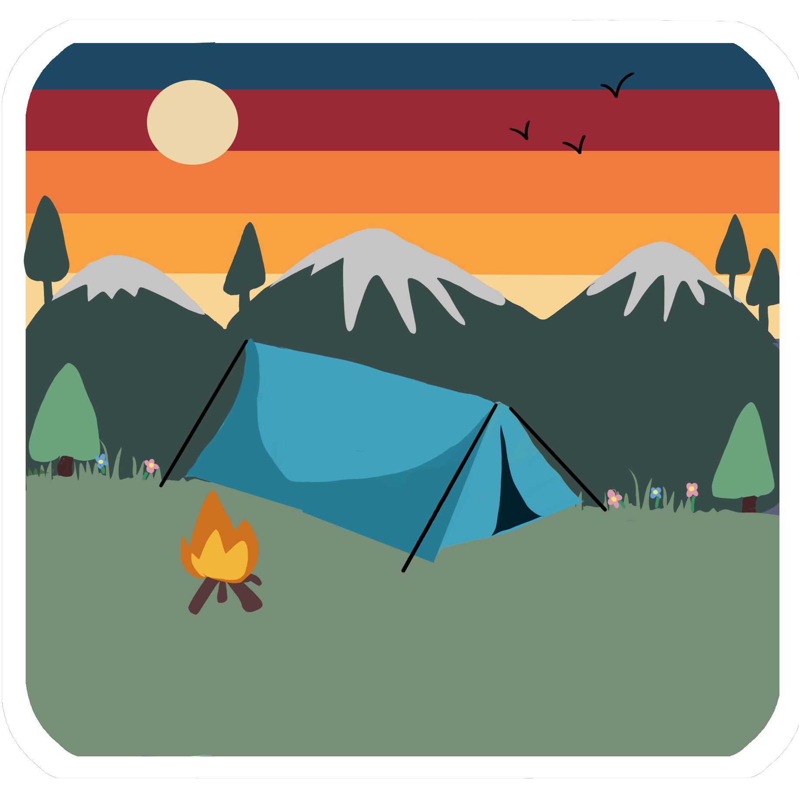
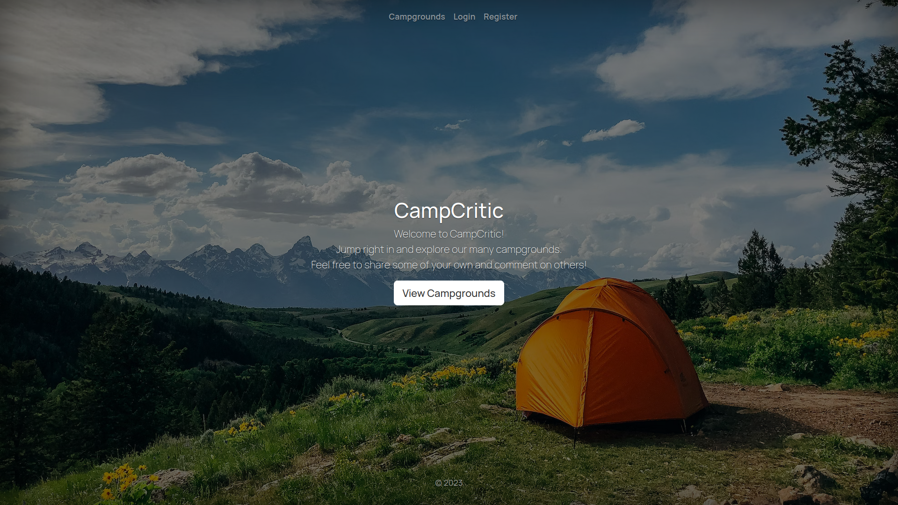
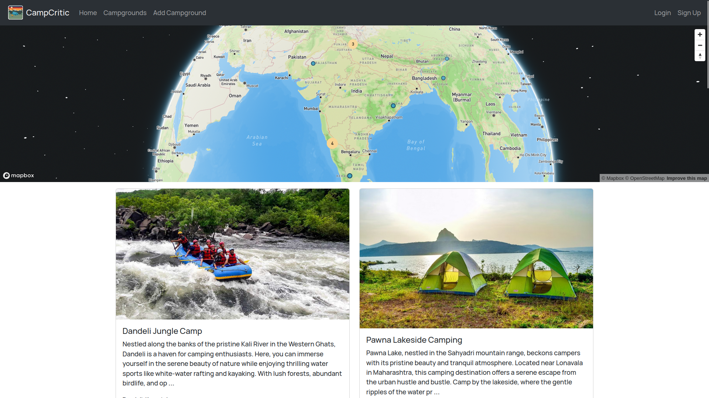
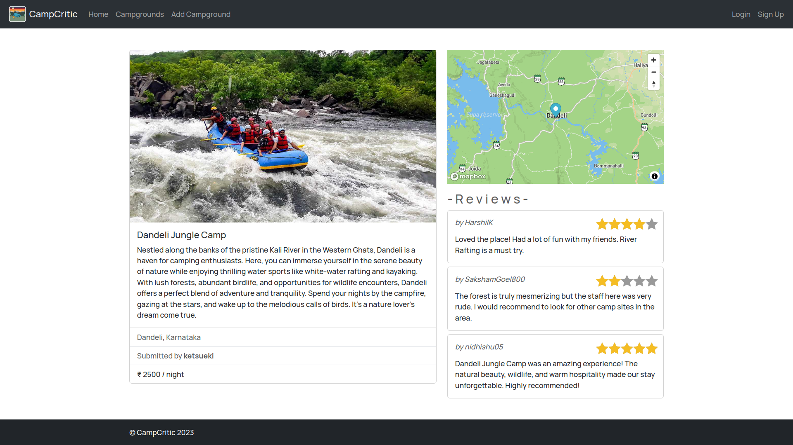

  

# CampCritic

[CampCritic](https://campcritic-q1v1.onrender.com/) is a full-stack web application for campers and outdoor enthusiasts. It allows users to discover and review campsites. In order to review or create a campground, you must have an account. This project was inspired by YelpCamp from Colt Steele's WebDev Bootcamp on Udemy.

This project was created using Node.js, Express.js, MongoDB, and Bootstrap. Passport.js was used to handle authentication. MapBox integration offers location-based services. Cloudinary is utilized for media uploads.

### Screenshots

## 

---

## Requirements

For development, you will need Node.js and MongoDB

### Node

-   #### Node installation on Windows

    Just go on [official Node.js website](https://nodejs.org/) and download the installer.
    Also, be sure to have `git` available in your PATH, `npm` might need it (You can find git [here](https://git-scm.com/)).

-   #### Node installation on Ubuntu

    You can install nodejs and npm easily with apt install, just run the following commands.

        $ sudo apt install nodejs
        $ sudo apt install npm

-   #### Other Operating Systems
    You can find more information about the installation on the [official Node.js website](https://nodejs.org/) and the [official NPM website](https://npmjs.org/).

If the installation was successful, you should be able to run the following command.

    $ node --version
    v18.18.0

    $ npm --version
    9.8.1

### MongoDB

Refer [official MongoDB website](https://www.mongodb.com/docs/v3.0/installation/) for installation instructions.

If the installation was successful, you should be able to run the following command.

    $ mongo --version
    MongoDB shell version v4.4.4
    Build Info: { ... }

###

---

## Install

    $ git clone https://github.com/ketsueki33/CampCritic.git
    $ cd CampCritic
    $ npm install

## Configure app

Create a Cloudinary account to get an API key and a Cloudinary secret code. Create a MapBox account to get a MapBox token.

Create a .env file (or just export manually in the terminal) in the root of the project and add the following:

    SECRET  = <any random string>
    CLOUDINARY_CLOUD_NAME = <cloud name>
    CLOUDINARY_KEY = <api key>
    CLOUDINARY_SECRET = <cloudinary secret>
    MAPBOX_TOKEN = <token>
    DB_URL = mongodb://127.0.0.1:27017/camp-critic

## Running the project

Start MongoDB by running the following command:

    $ sudo systemctl start mongod

Start the server by running the following command in the root directory:
 
    $ node app.js

Open your browser and navigate to [localhost:3000](localhost:3000).